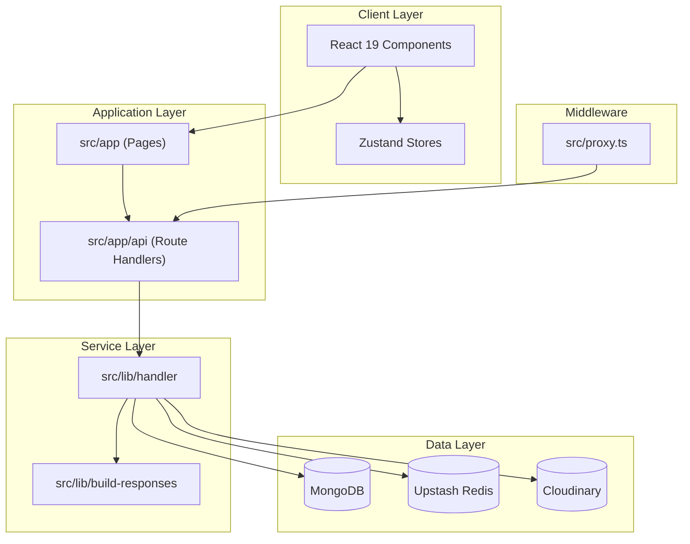
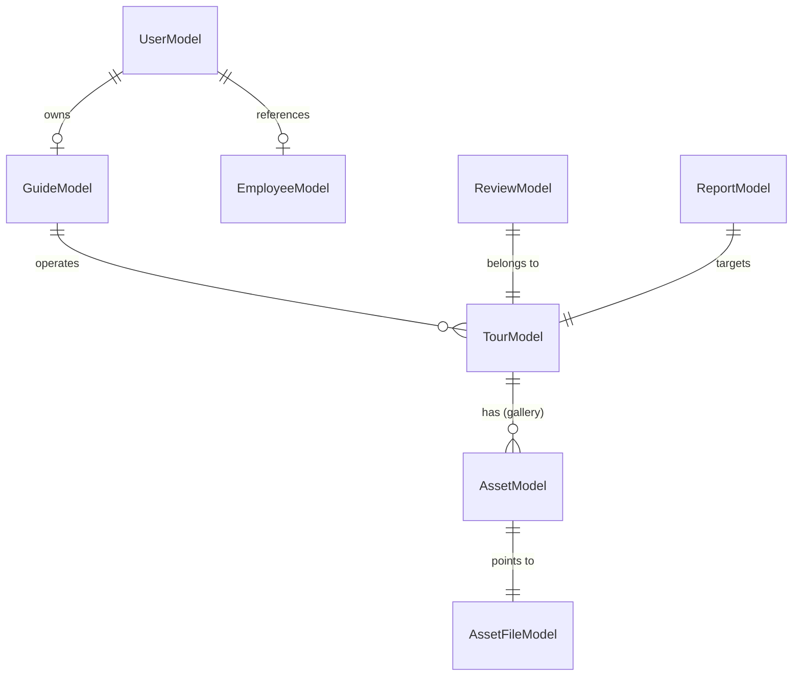

# 🧭 BD Travel Spirit Guide System

A full-stack platform for managing tour guide operations in Bangladesh, built with **Next.js 16 (Beta)**, **MongoDB**, and **NextAuth v5**. It provides a public landing page for travelers and a role-based dashboard for Guides and Assistants to manage tours, bookings, reviews, employees, payments, and real-time communication.

---

## 📚 Table of Contents

- [Tech Stack](#-tech-stack)
- [System Architecture](#-system-architecture)
- [User Roles](#-user-roles--permissions)
- [Features](#-features)
- [Project Structure](#-project-structure)
- [API Usage](#-api-usage)
- [Getting Started](#-getting-started)
- [Configuration](#-configuration)
- [Data Models](#-data-models)
- [State Management](#-state-management)
- [Glossary](#-glossary)

---

## 🛠 Tech Stack

<details>
<summary><strong>Core Framework & Runtime</strong></summary>

| Technology | Version | Role |
|---|---|---|
| Next.js | `^16.0.0-beta.0` | App Router framework with Turbopack, hosts both pages and API route handlers |
| React | `^19.2.3` | UI library |
| TypeScript | `^5` | Static typing across the stack |

</details>

<details>
<summary><strong>Data & Infrastructure</strong></summary>

- **Database**: MongoDB via Mongoose (`^8.19.1`)
- **Caching & Rate Limiting**: Upstash Redis (`^1.36.0`)
- **Authentication**: NextAuth.js v5 (Credentials + Google OAuth)
- **Media Pipeline**: Cloudinary
- **State Management**: Zustand (`^5.0.8`)
- **Payments**: Stripe

</details>

<details>
<summary><strong>UI & UX Engine</strong></summary>

- **Styling**: Tailwind CSS 4.0
- **Components**: Radix UI primitives (shadcn/ui style)
- **Animations**: Framer Motion
- **Visualization**: Recharts, React Leaflet
- **Real-time**: Socket.IO

</details>

---

## 🏗 System Architecture



Every API route is wrapped with a shared `withErrorHandler` higher-order function that standardizes success/error JSON shapes, and `src/proxy.ts` applies rate limiting and session/role gating before requests reach the route handlers.

---

## 👥 User Roles & Permissions

| Role | Identifier | Permissions |
|---|---|---|
| **Guide** | `USER_ROLE.GUIDE` | Full ownership: tours, employees, payment accounts, financial analytics |
| **Assistant** | `USER_ROLE.ASSISTANT` | Operational support: review moderation, report triage, logistics updates |
| **Admin** | `USER_ROLE.ADMIN` | Platform-level moderation (tour approval, notifications) |
| **Traveler** | Public user | Browse tours, leave reviews, chat with support |

Login is gated at the credential-validation stage: Guides must have an `APPROVED` `GuideModel` status, and Assistants must have a non-deleted `EmployeeModel` record.

---

## ✨ Features

<details>
<summary><strong>🌐 Landing Page</strong></summary>

- Server-rendered hero, advantages, "How it Works", testimonials, and CTA sections
- Live stats hydrated from MongoDB
- Sticky navbar with conditional Login/Dashboard rendering

</details>

<details>
<summary><strong>🔐 Authentication & Authorization</strong></summary>

- NextAuth v5 (Credentials + Google OAuth), JWT sessions (30-day max age, hourly refresh)
- Email verification via hashed tokens
- Rate-limited credential validation (10/min per IP, 5/min per email) via Upstash Redis
- Role-based UI + API gating

</details>

<details>
<summary><strong>📊 Dashboard</strong></summary>

- KPI grid (tours, bookings, revenue, reports, ratings, staff)
- Charts for bookings/reviews via Recharts
- Per-tab date-range filtering, cursor-paginated transactions, CSV export
- TTL-based client-side caching (`useDashboardStore`)

</details>

<details>
<summary><strong>🗺️ Tour Management</strong></summary>

- Lifecycle: `DRAFT → SUBMITTED → APPROVED → ACTIVE → COMPLETED/ARCHIVED/TERMINATED`
- Multi-step wizard with modular PATCH endpoints per schema section
- Bangladesh-specific geography and itinerary modeling
- Moderation workflow (archive/terminate/re-approval)

</details>

<details>
<summary><strong>⭐ Review & 🚩 Report Management</strong></summary>

- Threaded replies with approval gating
- Report triage with priority and bulk-resolve actions

</details>

<details>
<summary><strong>👔 Employee Management & 💳 Payments</strong></summary>

- Payroll, shifts, soft-deletion, Stripe payment account linkage

</details>

<details>
<summary><strong>💬 Real-time Communication</strong></summary>

- Socket.IO presence tracking and system notifications with priority-based TTL

</details>

---

## 📁 Project Structure

<details>
<summary><strong>Root Structure</strong></summary>

```text
bd-travel-spirit-guide-system/
├── src/
│   ├── app/                # Routes + API handlers
│   ├── components/         # React components
│   ├── config/             # Stripe/DB config
│   ├── constants/          # Enums
│   ├── lib/                # Business logic, builders, handlers, helpers
│   ├── models/              # Mongoose schemas
│   ├── socket/              # Socket.IO helpers
│   ├── store/                # Zustand stores
│   ├── types/                # Shared types/DTOs
│   ├── utils/                 # API clients, validators
│   └── proxy.ts               # Middleware (rate-limit + auth guard)
├── public/
└── package.json
```

</details>

<details>
<summary><strong>src/app/api — API Route Handlers</strong></summary>

```text
src/app/api/
├── auth/
│   ├── [...nextauth]/           # NextAuth handler (signIn/signOut/session)
│   ├── token/v1/                 # Token-based flows
│   └── user/v1/
│       ├── validate/             # Pre-NextAuth credential validation
│       ├── password/             # Password change/reset
│       ├── audits/               # Audit log queries
│       ├── employee/, owner/, name/
│       └── route.ts              # User CRUD (register)
├── dashboard/v1/
│   ├── stats/, tours/, bookings/, reviews/, reports/
│   ├── employees/, running-tours/, faqs/, refunds/, transactions/
│   ├── profile/, export/, search/
├── operations/
│   ├── tours/v1/
│   │   ├── route.ts                        # GET list / POST create
│   │   └── [tourId]/
│   │       ├── route.ts                    # GET detail / POST submit-for-approval
│   │       ├── bangladesh-fields/          # PATCH step-1
│   │       ├── logistics/                  # PATCH step-3
│   │       ├── pricing/                    # PATCH step-4
│   │       ├── gallery/                    # PATCH gallery images
│   │       ├── destinations/images-bulk/   # PATCH destination images
│   │       ├── destinations/attractions/images-bulk/
│   │       └── moderation-status/
│   │           ├── archive/                # DELETE (soft-delete/archive)
│   │           └── terminate/              # DELETE (terminate + refunds)
│   ├── bookings/v1/
│   │   ├── route.ts
│   │   └── summary/
│   ├── reviews/v1/
│   │   ├── route.ts
│   │   └── [reviewId]/replies/[replyId]/   # PATCH/DELETE reply
│   └── reports/v1/
│       ├── route.ts
│       ├── [reportId]/
│       └── bulk-resolve/
├── users/employees/v1/
│   ├── route.ts               # POST create employee
│   ├── [employeeId]/          # GET/PATCH/DELETE
│   └── payroll/
├── settings/payment-accounts/v1/
│   ├── route.ts
│   └── [id]/
├── support/
│   ├── password-requests/v1/  # Employee forgot-password workflow
│   └── tour-faq/
│       ├── route.ts
│       ├── [faqId]/
│       └── stats/
├── notifications/guide/v1/
│   ├── route.ts
│   └── [id]/
└── (mock)/mock/                # Mock/dev-only endpoints
```

</details>

---

## 🔌 API Usage

All API routes live under `src/app/api` following Next.js App Router conventions (`route.ts` files exporting `GET`/`POST`/`PATCH`/`DELETE`). Every handler is wrapped by `withErrorHandler`.

<details>
<summary><strong>Response & Error Contract</strong></summary>

Every route handler returns a `HandlerResult<T>` (`{ data, status? }`), and `withErrorHandler` converts it into a `NextResponse`:

- **Success**: `{ "data": <T> }` with the given HTTP status (default `200`)
- **Failure**: `{ "error": "<message>" }` with a status derived from a thrown `ApiError(message, status)`, or `500` for unhandled errors

```ts
// Example handler shape
export const PATCH = withErrorHandler(async (req, { params }) => {
  // ...validation, DB ops...
  return { data: result, status: 200 };
});
```

Throwing `throw new ApiError("Tour not found", 404)` anywhere inside a handler is automatically caught and serialized.

</details>

<details>
<summary><strong>Authentication Flow</strong></summary>

1. **Credential pre-validation** — `POST /api/auth/user/v1/validate` checks email/password against `UserModel`, enforces IP- and email-based rate limiting (10/min per IP, 5/min per email) via `authRateLimit` (Upstash Redis), and confirms role eligibility (`GUIDE` must be `APPROVED`, `ASSISTANT` must not be soft-deleted) before returning a minimal `{ id, email, role }` payload.
2. **NextAuth session issuance** — `src/app/api/auth/[...nextauth]/` (backed by `src/lib/auth/options.auth.ts`) re-runs the same checks inside its `CredentialsProvider.authorize` and `signIn` callback (for Google OAuth), then issues a JWT session (30-day max age, refreshed hourly).
3. **Session consumption** — Downstream API routes call `requireSessionUserId()` / `getUserIdFromSession()` to identify the caller, and `VERIFY_USER_ROLE.GUIDE(...)` / `.MULTIPLE([...])` helpers to enforce role-based authorization per endpoint.

</details>

<details>
<summary><strong>Middleware: Rate Limiting & Route Protection (`src/proxy.ts`)</strong></summary>

- Public routes pass through without checks.
- All other `/api/*` routes are rate-limited to **100 requests / 60 seconds per IP**, returning `429` on breach.
- Protected pages require a valid NextAuth session (redirect to `/` if missing).
- Admin-tier pages (`ADMIN_ROLES = [ADMIN, GUIDE]`) redirect non-privileged users to `/dashboard?error=unauthorized`.

</details>

<details>
<summary><strong>Tour Endpoints</strong> (<code>/api/operations/tours/v1</code>)</summary>

| Method | Path | Purpose |
|---|---|---|
| `GET` | `/` | List tours (filterable) |
| `POST` | `/` | Create a new tour (`DRAFT` status) |
| `GET` | `/[tourId]` | Full tour detail via `buildTourDetailDTO` |
| `POST` | `/[tourId]` | Submit tour for moderation/re-approval (creates a `SupportSystemNotification` and triggers a socket event to admins) |
| `PATCH` | `/[tourId]/bangladesh-fields` | Update step-1 (division, district, accommodation, etc.), validated via `Step1BangladeshSchema` |
| `PATCH` | `/[tourId]/logistics` | Update step-3 logistics (main location, transport), validated via `Step3LogisticsSchema` |
| `PATCH` | `/[tourId]/pricing` | Update step-4 pricing/discounts/duration, validated via `Step4PricingSchema` |
| `PATCH` | `/[tourId]/gallery` | Replace/add gallery images (base64 or Cloudinary URL), resolves & dedupes assets outside the DB transaction |
| `PATCH` | `/[tourId]/destinations/images-bulk` | Bulk add/delete images for a destination |
| `PATCH` | `/[tourId]/destinations/attractions/images-bulk` | Bulk add/delete images for a specific attraction within a destination |
| `DELETE` | `/[tourId]/moderation-status/archive` | Soft-delete/archive a tour (Guide/Assistant only) |
| `DELETE` | `/[tourId]/moderation-status/terminate` | Terminate a tour, cascading into bookings/transactions/refunds via Stripe |

All mutating endpoints share common guardrails: tours in `TERMINATED`, `ARCHIVED`, or `ACTIVE`/`COMPLETED` states reject further edits with `409 Conflict`, and every mutation is wrapped in `withTransaction` for atomicity, followed by `auditTourMutation` logging.

</details>

<details>
<summary><strong>Review Endpoints</strong> (<code>/api/operations/reviews/v1</code>)</summary>

| Method | Path | Purpose |
|---|---|---|
| `GET`/other | `/` | List/query reviews |
| `POST` | `/[reviewId]/replies` | Add a reply (Guide/Assistant only), rejects if review isn't `isApproved` |
| `PATCH` | `/[reviewId]/replies/[replyId]` | Edit own reply |
| `DELETE` | `/[reviewId]/replies/[replyId]` | Soft-delete own reply |

</details>

<details>
<summary><strong>Booking & Report Endpoints</strong></summary>

- `/api/operations/bookings/v1` — `route.ts` (CRUD/list) + `summary/` (aggregate stats)
- `/api/operations/reports/v1` — `route.ts` (list/create), `[reportId]/` (detail/update), `bulk-resolve/` (batch resolution action)

</details>

<details>
<summary><strong>Dashboard Endpoints</strong> (<code>/api/dashboard/v1</code>)</summary>

Sub-resources: `stats/`, `tours/`, `bookings/`, `reviews/`, `reports/`, `employees/`, `running-tours/`, `faqs/`, `refunds/`, `transactions/`, `profile/`, `export/`, `search/` — each accepts date-range query params (e.g. `statsDateRangeFrom`/`statsDateRangeTo`) matching the `DashboardFilters` shape consumed by `useDashboardStore` on the client, and `export/` produces CSV downloads.

</details>

<details>
<summary><strong>Employee & Payment Endpoints</strong></summary>

- `POST /api/users/employees/v1` — create employee (validates via Yup, requires `GUIDE` role, uploads avatar/documents to Cloudinary, creates linked `UserModel` with `ASSISTANT` role)
- `/api/users/employees/v1/[employeeId]` — detail/update/terminate
- `/api/users/employees/v1/payroll` — payroll record management
- `/api/settings/payment-accounts/v1` and `[id]/` — Stripe payment account CRUD

</details>

<details>
<summary><strong>Support Endpoints</strong></summary>

- `POST /api/support/password-requests/v1` — employee "forgot password" request; rate-limited per email (5/min), branches by role (`ASSISTANT` vs `GUIDE`), rejects duplicate pending requests
- `/api/support/tour-faq/` — `route.ts` (list/create), `[faqId]/` (update/delete), `stats/` (aggregate counts)

</details>

<details>
<summary><strong>Notification Endpoints</strong></summary>

- `/api/notifications/guide/v1` — `route.ts` (list) + `[id]/` (mark read/delete). Notifications carry priority-based TTL: `LOW`/`MEDIUM` expire after 60 days, `HIGH`/`CRITICAL` never auto-expire.

</details>

<details>
<summary><strong>Calling Conventions Summary</strong></summary>

- Dynamic route params are `Promise<{ id: string }>`-typed (Next.js 15+/16 async params) and resolved with `resolveMongoId(...)`.
- Most mutation routes: (1) resolve/validate the ID, (2) resolve the acting user via `requireSessionUserId()`, (3) validate body with Yup/Zod, (4) run DB writes inside `withTransaction`, (5) call `auditTourMutation`/`logAuditForActor` for audit trail, (6) return a rebuilt DTO via `buildTourDetailDTO` or similar builder.
- Cloudinary uploads are deliberately executed **outside** Mongo transactions to avoid the 60-second transaction timeout, with asset dedup/cleanup handled separately.

</details>

---

## 🚀 Getting Started

<details>
<summary><strong>Prerequisites</strong></summary>

| Requirement | Version | Purpose |
|---|---|---|
| Node.js | 20.x+ | Runtime |
| npm | 10.x+ | Package management |
| MongoDB | 7.0+ | Database |
| Redis | Upstash / Local | Caching & rate limiting |

</details>

<details>
<summary><strong>Installation & Development</strong></summary>

```bash
git clone https://github.com/ByteCrister/bd-travel-spirit-guide-system
cd bd-travel-spirit-guide-system
npm install
npm run dev     # http://localhost:3000, Turbopack
npm run build
npm run lint
```

Configure a `.env` with MongoDB, NextAuth, Cloudinary, Stripe, and Upstash Redis credentials (`.env*` is git-ignored).

</details>

---

## ⚙️ Configuration

| File | Purpose |
|---|---|
| `tsconfig.json` | `@/*` → `src/*` path alias |
| `next.config.ts` | Image remote patterns (Cloudinary, GitHub avatars, etc.) |
| `postcss.config.mjs` | Tailwind CSS 4.0 |
| `eslint.config.mjs` | Lint presets |

---

## 🗄 Data Models



---

## 🧩 State Management

Key stores: `useDashboardStore`, `useTourDetailStore`, `useReviewsStore`, `useReportsStore`, `useEmployeeStore`, `useNotificationStore`, `useCurrentUserStore`, `usePaymentAccountStore` — using TTL caching and in-flight request de-duplication.

---

## 📖 Glossary

| Term | Meaning |
|---|---|
| **Guide** | Tour operator/business owner role |
| **Assistant** | Employee/support role |
| **DTO** | Data Transfer Object returned by builder functions like `buildTourDetailDTO` |
| **ApiError** | Custom error class carrying an HTTP status, caught by `withErrorHandler` |
| **withTransaction** | Helper wrapping Mongo multi-document writes in a session/transaction |
| **Asset / AssetFile** | Two-tier deduplicated media model |